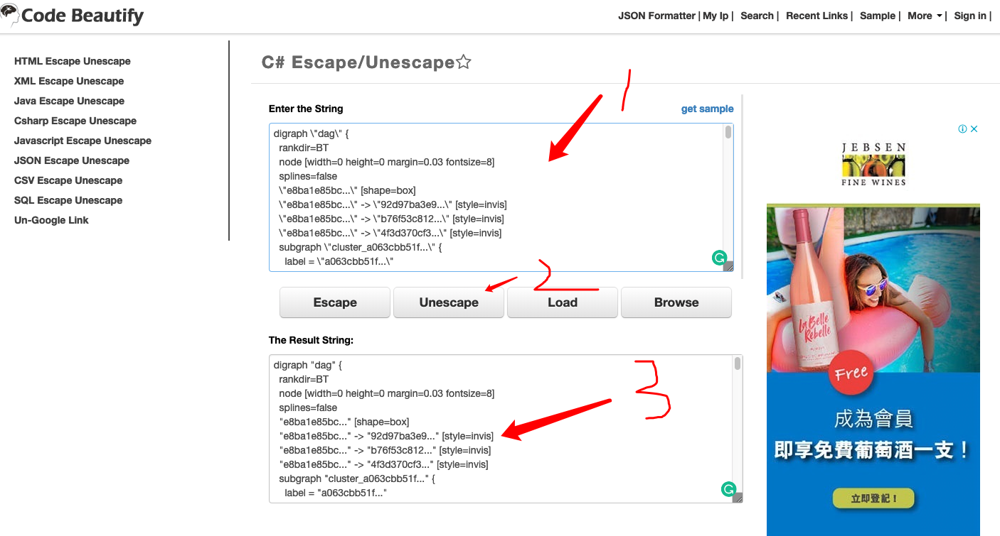
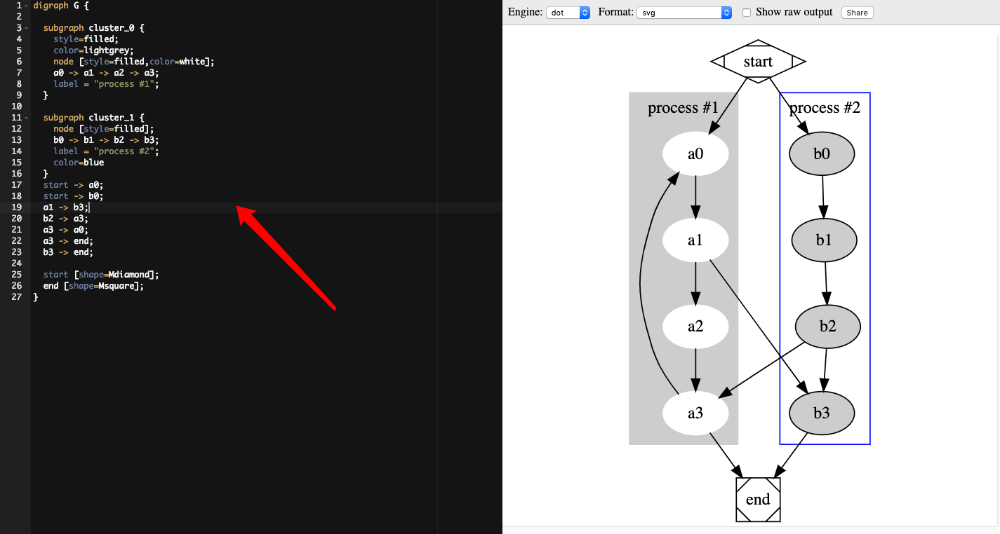

图形化RChain上dag
=======================

复制vdag数据
--------------

在节点上运行

    $ rnode vdag

现实以下内容

    status: "Success"

    content: "digraph \"dag\" {\n  rankdir=BT\n  node [width=0 height=0 margin=0.03 fontsize=8]\n  splines=false\n  \"e8ba1e85bc...\" [shape=box]\n  \"e8ba1e85bc...\" -> \"92d97ba3e9...\" [style=invis]\n  \"e8ba1e85bc...\" -> \"b76f53c812...\" [style=invis]\n  \"e8ba1e85bc...\" -> \"4f3d370cf3...\" [style=invis]\n  subgraph \"cluster_a063cbb51f...\" {\n    label = \"a063cbb51f...\"\n    \"92d97ba3e9...\" [shape=box]\n    \"da4e9d1720...\" [shape=box]\n    \"0644ba74cc...\" [shape=box]\n    \"cb798dd43b...\" [shape=box]\n    \"5d9d109f0a...\" [shape=box]\n    \"6_a063cbb51f...\" [style=invis shape=box]\n    \"0e4662c7f3...\" [shape=box]\n    \"69e1d47bb6...\" [shape=box]\n    \"4dab5755d2...\" [shape=box]\n    \"10_a063cbb51f...\" [style=invis shape=box]\n    \"7630b5e06b...\" [shape=box]\n    \"6e85a84d53...\" [shape=box]\n    \"13_a063cbb51f...\" [style=invis shape=box]\n    \"92d97ba3e9...\" -> \"da4e9d1720...\" [style=invis]\n    \"da4e9d1720...\" -> \"0644ba74cc...\" [style=invis]\n    \"0644ba74cc...\" -> \"cb798dd43b...\" [style=invis]\n    \"cb798dd43b...\" -> \"5d9d109f0a...\" [style=invis]\n    \"5d9d109f0a...\" -> \"6_a063cbb51f...\" [style=invis]\n    \"6_a063cbb51f...\" -> \"0e4662c7f3...\" [style=invis]\n    \"0e4662c7f3...\" -> \"69e1d47bb6...\" [style=invis]\n    \"69e1d47bb6...\" -> \"4dab5755d2...\" [style=invis]\n    \"4dab5755d2...\" -> \"10_a063cbb51f...\" [style=invis]\n    \"10_a063cbb51f...\" -> \"7630b5e06b...\" [style=invis]\n    \"7630b5e06b...\" -> \"6e85a84d53...\" [style=invis]\n    \"6e85a84d53...\" -> \"13_a063cbb51f...\" [style=invis]\n  }\n  subgraph \"cluster_e8efbecd4f...\" {\n    label = \"e8efbecd4f...\"\n    \"b76f53c812...\" [shape=box]\n    \"280c5039fa...\" [shape=box]\n    \"3abe9bdb67...\" [shape=box]\n    \"ea9e2eed68...\" [shape=box]\n    \"fe076db8c3...\" [shape=box]\n    \"6_e8efbecd4f...\" [style=invis shape=box]\n    \"2e413d865d...\" [shape=box]\n    \"a1c9e0d3e1...\" [shape=box]\n    \"b83e7f41c9...\" [shape=box]\n    \"bf56e81d34...\" [shape=box]\n    \"47dfd32313...\" [shape=box]\n    \"12_e8efbecd4f...\" [style=invis shape=box]\n    \"9c89df2ed3...\" [shape=box]\n    \"b76f53c812...\" -> \"280c5039fa...\" [style=invis]\n    \"280c5039fa...\" -> \"3abe9bdb67...\" [style=invis]\n    \"3abe9bdb67...\" -> \"ea9e2eed68...\" [style=invis]\n    \"ea9e2eed68...\" -> \"fe076db8c3...\" [style=invis]\n    \"fe076db8c3...\" -> \"6_e8efbecd4f...\" [style=invis]\n    \"6_e8efbecd4f...\" -> \"2e413d865d...\" [style=invis]\n    \"2e413d865d...\" -> \"a1c9e0d3e1...\" [style=invis]\n    \"a1c9e0d3e1...\" -> \"b83e7f41c9...\" [style=invis]\n    \"b83e7f41c9...\" -> \"bf56e81d34...\" [style=invis]\n    \"bf56e81d34...\" -> \"47dfd32313...\" [style=invis]\n    \"47dfd32313...\" -> \"12_e8efbecd4f...\" [style=invis]\n    \"12_e8efbecd4f...\" -> \"9c89df2ed3...\" [style=invis]\n  }\n  subgraph \"cluster_fc99ed51e7...\" {\n    label = \"fc99ed51e7...\"\n    \"4f3d370cf3...\" [style=filled shape=box]\n    \"8c66553531...\" [shape=box]\n    \"4bfff29156...\" [shape=box]\n    \"d85922bccc...\" [shape=box]\n    \"0822387491...\" [shape=box]\n    \"0914e8e26e...\" [shape=box]\n    \"0591264f68...\" [shape=box]\n    \"f15192f58b...\" [shape=box]\n    \"c0a47a403b...\" [shape=box]\n    \"e419f60b5c...\" [shape=box]\n    \"11_fc99ed51e7...\" [style=invis shape=box]\n    \"12_fc99ed51e7...\" [style=invis shape=box]\n    \"13_fc99ed51e7...\" [style=invis shape=box]\n    \"4f3d370cf3...\" -> \"8c66553531...\" [style=invis]\n    \"8c66553531...\" -> \"4bfff29156...\" [style=invis]\n    \"4bfff29156...\" -> \"d85922bccc...\" [style=invis]\n    \"d85922bccc...\" -> \"0822387491...\" [style=invis]\n    \"0822387491...\" -> \"0914e8e26e...\" [style=invis]\n    \"0914e8e26e...\" -> \"0591264f68...\" [style=invis]\n    \"0591264f68...\" -> \"f15192f58b...\" [style=invis]\n    \"f15192f58b...\" -> \"c0a47a403b...\" [style=invis]\n    \"c0a47a403b...\" -> \"e419f60b5c...\" [style=invis]\n    \"e419f60b5c...\" -> \"11_fc99ed51e7...\" [style=invis]\n    \"11_fc99ed51e7...\" -> \"12_fc99ed51e7...\" [style=invis]\n    \"12_fc99ed51e7...\" -> \"13_fc99ed51e7...\" [style=invis]\n  }\n  \"5d9d109f0a...\" -> \"d85922bccc...\" [constraint=false]\n  \"92d97ba3e9...\" -> \"e8ba1e85bc...\" [constraint=false]\n  \"4dab5755d2...\" -> \"f15192f58b...\" [constraint=false]\n  \"da4e9d1720...\" -> \"4f3d370cf3...\" [constraint=false]\n  \"6e85a84d53...\" -> \"7630b5e06b...\" [constraint=false]\n  \"0e4662c7f3...\" -> \"0914e8e26e...\" [constraint=false]\n  \"0644ba74cc...\" -> \"8c66553531...\" [constraint=false]\n  \"7630b5e06b...\" -> \"e419f60b5c...\" [constraint=false]\n  \"69e1d47bb6...\" -> \"0591264f68...\" [constraint=false]\n  \"cb798dd43b...\" -> \"4bfff29156...\" [constraint=false]\n  \"fe076db8c3...\" -> \"d85922bccc...\" [constraint=false]\n  \"bf56e81d34...\" -> \"4dab5755d2...\" [constraint=false]\n  \"b76f53c812...\" -> \"e8ba1e85bc...\" [constraint=false]\n  \"b83e7f41c9...\" -> \"f15192f58b...\" [constraint=false]\n  \"9c89df2ed3...\" -> \"6e85a84d53...\" [constraint=false]\n  \"280c5039fa...\" -> \"4f3d370cf3...\" [constraint=false]\n  \"2e413d865d...\" -> \"0914e8e26e...\" [constraint=false]\n  \"3abe9bdb67...\" -> \"8c66553531...\" [constraint=false]\n  \"47dfd32313...\" -> \"e419f60b5c...\" [constraint=false]\n  \"a1c9e0d3e1...\" -> \"0591264f68...\" [constraint=false]\n  \"ea9e2eed68...\" -> \"4bfff29156...\" [constraint=false]\n  \"0822387491...\" -> \"d85922bccc...\" [constraint=false]\n  \"e419f60b5c...\" -> \"c0a47a403b...\" [constraint=false]\n  \"4f3d370cf3...\" -> \"e8ba1e85bc...\" [constraint=false]\n  \"0914e8e26e...\" -> \"0822387491...\" [constraint=false]\n  \"c0a47a403b...\" -> \"f15192f58b...\" [constraint=false]\n  \"8c66553531...\" -> \"4f3d370cf3...\" [constraint=false]\n  \"0591264f68...\" -> \"0914e8e26e...\" [constraint=false]\n  \"4bfff29156...\" -> \"8c66553531...\" [constraint=false]\n  \"f15192f58b...\" -> \"0591264f68...\" [constraint=false]\n  \"d85922bccc...\" -> \"4bfff29156...\" [constraint=false]\n}"

复制 content："后的文本,注意是双引号以后，到最后一个双引号前

复制的文本正常是

    digraph \"dag\" {\n  rankdir=BT\n  node [width=0 height=0 margin=0.03 fontsize=8]\n  splines=false\n  \"e8ba1e85bc...\" [shape=box]\n  \"e8ba1e85bc...\" -> \"92d97ba3e9...\" [style=invis]\n  \"e8ba1e85bc...\" -> \"b76f53c812...\" [style=invis]\n  \"e8ba1e85bc...\" -> \"4f3d370cf3...\" [style=invis]\n  subgraph \"cluster_a063cbb51f...\" {\n    label = \"a063cbb51f...\"\n    \"92d97ba3e9...\" [shape=box]\n    \"da4e9d1720...\" [shape=box]\n    \"0644ba74cc...\" [shape=box]\n    \"cb798dd43b...\" [shape=box]\n    \"5d9d109f0a...\" [shape=box]\n    \"6_a063cbb51f...\" [style=invis shape=box]\n    \"0e4662c7f3...\" [shape=box]\n    \"69e1d47bb6...\" [shape=box]\n    \"4dab5755d2...\" [shape=box]\n    \"10_a063cbb51f...\" [style=invis shape=box]\n    \"7630b5e06b...\" [shape=box]\n    \"6e85a84d53...\" [shape=box]\n    \"13_a063cbb51f...\" [style=invis shape=box]\n    \"92d97ba3e9...\" -> \"da4e9d1720...\" [style=invis]\n    \"da4e9d1720...\" -> \"0644ba74cc...\" [style=invis]\n    \"0644ba74cc...\" -> \"cb798dd43b...\" [style=invis]\n    \"cb798dd43b...\" -> \"5d9d109f0a...\" [style=invis]\n    \"5d9d109f0a...\" -> \"6_a063cbb51f...\" [style=invis]\n    \"6_a063cbb51f...\" -> \"0e4662c7f3...\" [style=invis]\n    \"0e4662c7f3...\" -> \"69e1d47bb6...\" [style=invis]\n    \"69e1d47bb6...\" -> \"4dab5755d2...\" [style=invis]\n    \"4dab5755d2...\" -> \"10_a063cbb51f...\" [style=invis]\n    \"10_a063cbb51f...\" -> \"7630b5e06b...\" [style=invis]\n    \"7630b5e06b...\" -> \"6e85a84d53...\" [style=invis]\n    \"6e85a84d53...\" -> \"13_a063cbb51f...\" [style=invis]\n  }\n  subgraph \"cluster_e8efbecd4f...\" {\n    label = \"e8efbecd4f...\"\n    \"b76f53c812...\" [shape=box]\n    \"280c5039fa...\" [shape=box]\n    \"3abe9bdb67...\" [shape=box]\n    \"ea9e2eed68...\" [shape=box]\n    \"fe076db8c3...\" [shape=box]\n    \"6_e8efbecd4f...\" [style=invis shape=box]\n    \"2e413d865d...\" [shape=box]\n    \"a1c9e0d3e1...\" [shape=box]\n    \"b83e7f41c9...\" [shape=box]\n    \"bf56e81d34...\" [shape=box]\n    \"47dfd32313...\" [shape=box]\n    \"12_e8efbecd4f...\" [style=invis shape=box]\n    \"9c89df2ed3...\" [shape=box]\n    \"b76f53c812...\" -> \"280c5039fa...\" [style=invis]\n    \"280c5039fa...\" -> \"3abe9bdb67...\" [style=invis]\n    \"3abe9bdb67...\" -> \"ea9e2eed68...\" [style=invis]\n    \"ea9e2eed68...\" -> \"fe076db8c3...\" [style=invis]\n    \"fe076db8c3...\" -> \"6_e8efbecd4f...\" [style=invis]\n    \"6_e8efbecd4f...\" -> \"2e413d865d...\" [style=invis]\n    \"2e413d865d...\" -> \"a1c9e0d3e1...\" [style=invis]\n    \"a1c9e0d3e1...\" -> \"b83e7f41c9...\" [style=invis]\n    \"b83e7f41c9...\" -> \"bf56e81d34...\" [style=invis]\n    \"bf56e81d34...\" -> \"47dfd32313...\" [style=invis]\n    \"47dfd32313...\" -> \"12_e8efbecd4f...\" [style=invis]\n    \"12_e8efbecd4f...\" -> \"9c89df2ed3...\" [style=invis]\n  }\n  subgraph \"cluster_fc99ed51e7...\" {\n    label = \"fc99ed51e7...\"\n    \"4f3d370cf3...\" [style=filled shape=box]\n    \"8c66553531...\" [shape=box]\n    \"4bfff29156...\" [shape=box]\n    \"d85922bccc...\" [shape=box]\n    \"0822387491...\" [shape=box]\n    \"0914e8e26e...\" [shape=box]\n    \"0591264f68...\" [shape=box]\n    \"f15192f58b...\" [shape=box]\n    \"c0a47a403b...\" [shape=box]\n    \"e419f60b5c...\" [shape=box]\n    \"11_fc99ed51e7...\" [style=invis shape=box]\n    \"12_fc99ed51e7...\" [style=invis shape=box]\n    \"13_fc99ed51e7...\" [style=invis shape=box]\n    \"4f3d370cf3...\" -> \"8c66553531...\" [style=invis]\n    \"8c66553531...\" -> \"4bfff29156...\" [style=invis]\n    \"4bfff29156...\" -> \"d85922bccc...\" [style=invis]\n    \"d85922bccc...\" -> \"0822387491...\" [style=invis]\n    \"0822387491...\" -> \"0914e8e26e...\" [style=invis]\n    \"0914e8e26e...\" -> \"0591264f68...\" [style=invis]\n    \"0591264f68...\" -> \"f15192f58b...\" [style=invis]\n    \"f15192f58b...\" -> \"c0a47a403b...\" [style=invis]\n    \"c0a47a403b...\" -> \"e419f60b5c...\" [style=invis]\n    \"e419f60b5c...\" -> \"11_fc99ed51e7...\" [style=invis]\n    \"11_fc99ed51e7...\" -> \"12_fc99ed51e7...\" [style=invis]\n    \"12_fc99ed51e7...\" -> \"13_fc99ed51e7...\" [style=invis]\n  }\n  \"5d9d109f0a...\" -> \"d85922bccc...\" [constraint=false]\n  \"92d97ba3e9...\" -> \"e8ba1e85bc...\" [constraint=false]\n  \"4dab5755d2...\" -> \"f15192f58b...\" [constraint=false]\n  \"da4e9d1720...\" -> \"4f3d370cf3...\" [constraint=false]\n  \"6e85a84d53...\" -> \"7630b5e06b...\" [constraint=false]\n  \"0e4662c7f3...\" -> \"0914e8e26e...\" [constraint=false]\n  \"0644ba74cc...\" -> \"8c66553531...\" [constraint=false]\n  \"7630b5e06b...\" -> \"e419f60b5c...\" [constraint=false]\n  \"69e1d47bb6...\" -> \"0591264f68...\" [constraint=false]\n  \"cb798dd43b...\" -> \"4bfff29156...\" [constraint=false]\n  \"fe076db8c3...\" -> \"d85922bccc...\" [constraint=false]\n  \"bf56e81d34...\" -> \"4dab5755d2...\" [constraint=false]\n  \"b76f53c812...\" -> \"e8ba1e85bc...\" [constraint=false]\n  \"b83e7f41c9...\" -> \"f15192f58b...\" [constraint=false]\n  \"9c89df2ed3...\" -> \"6e85a84d53...\" [constraint=false]\n  \"280c5039fa...\" -> \"4f3d370cf3...\" [constraint=false]\n  \"2e413d865d...\" -> \"0914e8e26e...\" [constraint=false]\n  \"3abe9bdb67...\" -> \"8c66553531...\" [constraint=false]\n  \"47dfd32313...\" -> \"e419f60b5c...\" [constraint=false]\n  \"a1c9e0d3e1...\" -> \"0591264f68...\" [constraint=false]\n  \"ea9e2eed68...\" -> \"4bfff29156...\" [constraint=false]\n  \"0822387491...\" -> \"d85922bccc...\" [constraint=false]\n  \"e419f60b5c...\" -> \"c0a47a403b...\" [constraint=false]\n  \"4f3d370cf3...\" -> \"e8ba1e85bc...\" [constraint=false]\n  \"0914e8e26e...\" -> \"0822387491...\" [constraint=false]\n  \"c0a47a403b...\" -> \"f15192f58b...\" [constraint=false]\n  \"8c66553531...\" -> \"4f3d370cf3...\" [constraint=false]\n  \"0591264f68...\" -> \"0914e8e26e...\" [constraint=false]\n  \"4bfff29156...\" -> \"8c66553531...\" [constraint=false]\n  \"f15192f58b...\" -> \"0591264f68...\" [constraint=false]\n  \"d85922bccc...\" -> \"4bfff29156...\" [constraint=false]\n}

生成图片
------------

打开网站：https://codebeautify.org/csharp-escape-unescape

如下图：

将你复制的文本粘贴在图中1部分，然后点击2中``Unescape``，然后复制3部分中的文本

打开网站: https://dreampuf.github.io/GraphvizOnline

如下图:

将文本黏贴在左侧，则能现实图形于右侧

